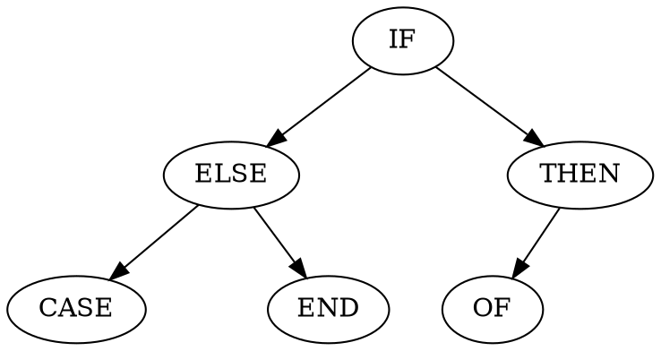

# Assesment for 

## Naming Style

Follow PEP8

## Environment 

Python 3.6.8

## To run unit test

## Complexity of `binarytree.printtree()`

### Time

The time complexity is $\Theta(n)$, where $n$ is the number of nodes in the tree (which is also the number of times executing the while-loop).

### Space

The space complexity is $O(log(n))$, where $n$ is the number of nodes in the tree.

The maximum memory usage occurs when the function is printing the level with most nodes.

#### example 1

#### example 2

For a complete tree with $n$ nodes, the number of nodes in the deepest full level is $2^{\lfloor log(n+1) \rfloor - 1}$.

For a tree with $n$ nodes, the maximum number the tree can have within a single level is between $2^{\lfloor log(n+1) \rfloor - 1}$ and $2^{\lfloor log(n+1) \rfloor}$

1 -> 1 OK 1 2
2 -> 1 OK 1 2
3 -> 2 OK 2 4
4 -> 2 OK 2 4
5 -> 2 OK 2 4
6 -> 3 ?? 2 4
7 -> 4 OK 4 8
8 -> 4 OK 4 8

n - (the max (power of 2)) which is smaller than n
vs
(the max (power of 2)) which is smaller than n

We can find this result considering the minimum number of nodes to achieve a tree with a level node number of  $m$ 

## Complextity of bunary search

